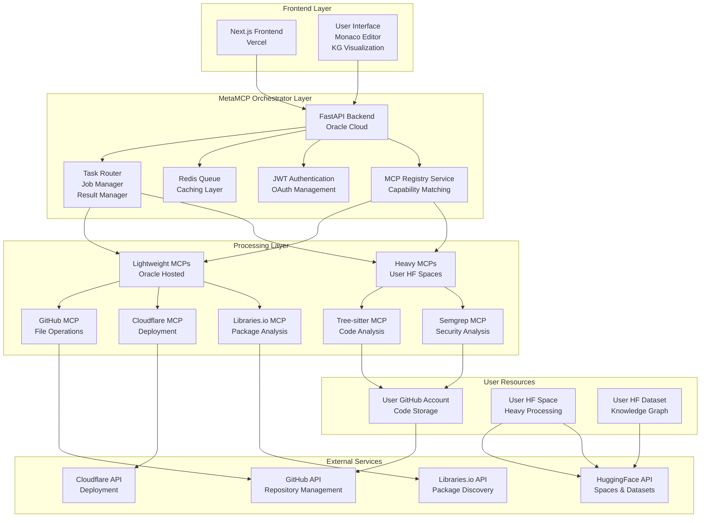
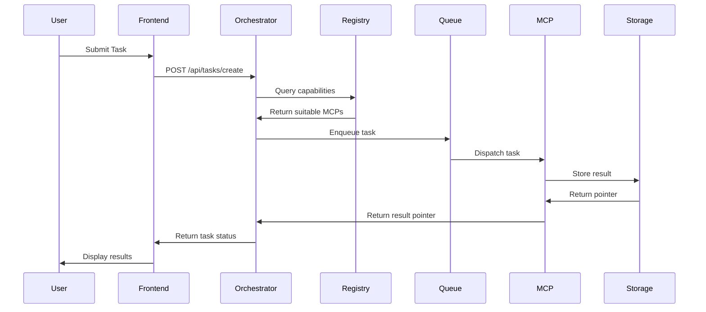
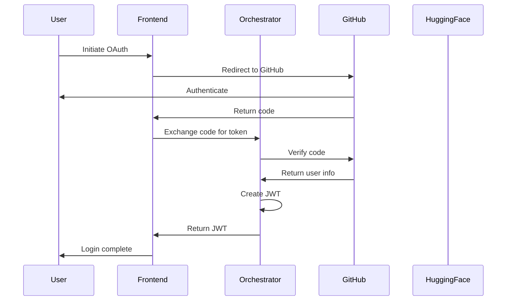
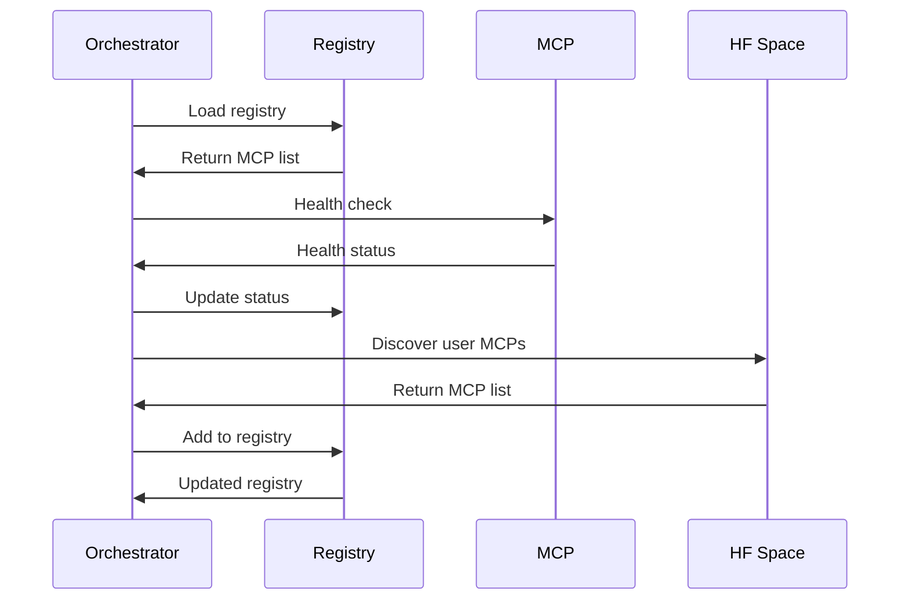
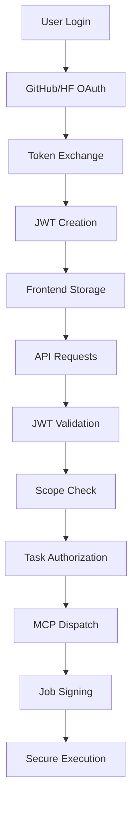

# 🏗️ MetaMCP Orchestrator Architecture

## High-Level Architecture Diagram

## Component Breakdown with Responsibilities

### 1. Frontend Layer (Vercel)
- **Next.js Application**: Main user interface with App Router
- **Monaco Editor**: Code editing with syntax highlighting and AI assistance
- **Knowledge Graph Visualizer**: Interactive graph rendering with D3.js/Cytoscape.js
- **Authentication UI**: OAuth flows for GitHub and HuggingFace
- **Real-time Updates**: WebSocket/SSE for task progress and results

### 2. MetaMCP Orchestrator Core (Oracle Cloud)
- **FastAPI Backend**: REST API with async support
- **Task Router**: Intelligent routing based on MCP capabilities and resource requirements
- **Job Manager**: Lifecycle management of tasks (create, execute, monitor, retry)
- **Result Manager**: Caching and retrieval of task results with pointer-based storage
- **Redis Queue**: Asynchronous task processing with priority support
- **JWT Authentication**: Token-based auth with scope management
- **OAuth Manager**: GitHub and HuggingFace integration

### 3. MCP Registry Service
- **Registry Manager**: Discovery and management of available MCP servers
- **Capability Matcher**: Task-to-MCP matching based on capabilities
- **Health Monitor**: Continuous health checks for all MCPs
- **Routing Flags**: Configuration for split-processing (Oracle vs HF Space)
- **Dynamic Discovery**: Auto-discovery of user-owned MCPs in HF Spaces

### 4. Lightweight MCPs (Oracle Hosted)
- **GitHub File-Seek Wrapper**: FastAPI-based file search and download
- **Cloudflare MCP Wrapper**: DNS, KV, R2, Workers API integration
- **Libraries.io MCP**: Package ecosystem analysis and dependency management
- **Multi-provider AI Proxy**: Unified interface for various AI services

### 5. Heavy MCPs (User HF Spaces)
- **Tree-sitter MCP**: AST parsing and code analysis
- **Semgrep MCP**: Security analysis and vulnerability scanning
- **kglab Adapter**: Knowledge graph operations and SPARQL queries
- **Coverage Aggregator**: Multi-framework coverage analysis

### 6. External Service Integration
- **GitHub API**: Repository management, file operations, webhook handling
- **HuggingFace API**: Space deployment, dataset management, model inference
- **Cloudflare API**: Deployment automation, DNS management
- **Libraries.io API**: Package discovery, dependency analysis

## Data Flow Between Components

### 1. User Task Flow

### 2. Authentication Flow

### 3. MCP Discovery Flow

## Integration Points with External Services

### GitHub Integration
- **Authentication**: OAuth with scopes: `public_repo`, `repo`, `workflow`, `user:email`
- **Repository Operations**: Create, clone, commit, branch management
- **File Operations**: Read, write, search, download files from repos
- **Webhook Handling**: Automated deployment triggers and status updates

### HuggingFace Integration
- **Authentication**: OAuth with scopes: `read`, `write`, `inference-api`
- **Space Management**: Deploy, update, monitor user-owned Spaces
- **Dataset Operations**: Create, update, query knowledge graph datasets
- **Model Inference**: Access to various AI models for code generation

### MCP Server Integration
- **Standard Protocol**: MCP (Model Context Protocol) for communication
- **Capability Discovery**: Dynamic capability querying and matching
- **Health Monitoring**: Regular health checks and status updates
- **Load Balancing**: Distribute tasks across available MCPs

## Security Considerations and Authentication Flow

### Authentication Layers
1. **Frontend Authentication**: NextAuth.js with secure token storage
2. **API Authentication**: JWT tokens with scope-based permissions
3. **MCP Communication**: Job signing with RS256 JWT for secure task execution
4. **External Services**: OAuth tokens with proper scope management

### Security Measures
- **Token Management**: Secure storage with automatic refresh
- **Scope Validation**: Minimal required permissions for each operation
- **Request Signing**: All MCP requests signed with user-specific tokens
- **Rate Limiting**: API rate limiting to prevent abuse
- **Input Validation**: Strict validation of all user inputs
- **Data Encryption**: Sensitive data encrypted at rest and in transit

### Authentication Flow Details

## Scalability and Deployment Considerations

### Oracle Cloud Deployment
- **Instance Type**: ARM instance with 24GB RAM, 4 vCPU
- **Storage**: Ephemeral disk for cache, persistent for data
- **Networking**: Load balancing, auto-scaling groups
- **Monitoring**: Prometheus + Grafana for metrics and alerts

### Horizontal Scaling
- **Stateless Services**: FastAPI backend designed for horizontal scaling
- **Redis Queue**: Distributed task processing with multiple workers
- **Database**: PostgreSQL with read replicas for scaling
- **CDN**: Static asset delivery via Oracle Cloud CDN

### Cost Optimization
- **Free Tier Utilization**: Maximize Oracle Cloud and HuggingFace free tiers
- **Resource Allocation**: Dynamic scaling based on load
- **Caching Strategy**: Redis caching for frequent operations
- **Spot Instances**: Use spot instances for non-critical workloads

### High Availability
- **Multi-region Deployment**: Primary and failover regions
- **Health Checks**: Automated health monitoring and failover
- **Backup Strategy**: Regular backups of critical data
- **Disaster Recovery**: Automated recovery procedures

### Performance Optimization
- **Async Processing**: Non-blocking operations for better throughput
- **Connection Pooling**: Efficient database and external API connections
- **Caching Layers**: Multi-level caching for frequently accessed data
- **Load Balancing**: Intelligent load distribution across resources

## Monitoring and Observability

### Metrics Collection
- **System Metrics**: CPU, memory, disk usage, network traffic
- **Application Metrics**: Request latency, error rates, queue depth
- **Business Metrics**: User activity, task success rates, resource usage
- **Custom Metrics**: MCP health, task routing efficiency

### Logging Strategy
- **Structured Logging**: JSON-formatted logs for easy parsing
- **Log Levels**: Appropriate log levels for different environments
- **Centralized Logging**: ELK stack for log aggregation and analysis
- **Error Tracking**: Integration with error tracking services

### Alerting System
- **Critical Alerts**: Uptime, security incidents, service failures
- **Warning Alerts**: Performance degradation, resource exhaustion
- **Info Alerts**: System updates, maintenance notifications
- **Custom Alerts**: Business-specific alerting conditions

## Configuration Management

### Environment Variables
- **Database Configuration**: Connection strings, credentials
- **External API Keys**: GitHub, HuggingFace, Cloudflare tokens
- **Security Settings**: JWT secrets, encryption keys
- **Feature Flags**: Toggle features for different environments

### Configuration Files
- **Docker Compose**: Local development environment setup
- **Kubernetes Configs**: Production deployment manifests
- **Nginx Configs**: Reverse proxy and SSL termination
- **Application Configs**: Feature flags and service settings

### Secrets Management
- **Secure Storage**: HashiCorp Vault or AWS Secrets Manager
- **Access Control**: Role-based access to secrets
- **Rotation**: Automatic secret rotation policies
- **Audit Logging**: Access logging for all secret operations