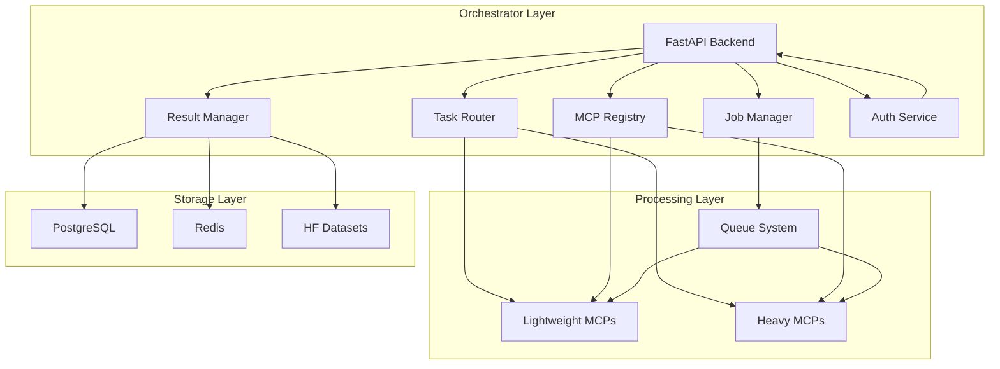

# 🔧 Technical Specifications - MetaMCP Orchestrator

## 1. System Architecture Overview

### 1.1 Core Principles
- **Split-Processing Model**: Lightweight operations on Oracle orchestrator, heavy processing on user HF Spaces
- **Capability-Based Routing**: Intelligent task routing based on MCP capabilities and resource requirements
- **Pointer-Based Results**: Large results stored in user HF Datasets with pointers returned
- **Job Signing**: Secure task execution with RS256 JWT signatures
- **Health Monitoring**: Continuous health checks and automatic failover

### 1.2 Architecture Patterns


## 2. MetaMCP Orchestrator Core

### 2.1 FastAPI Backend Structure

#### 2.1.1 Project Structure
```
orchestrator/
├── main.py                 # FastAPI application entry point
├── api/                    # API endpoints
│   ├── tasks.py           # Task management endpoints
│   ├── projects.py        # Project management endpoints
│   ├── mcps.py            # MCP operations endpoints
│   ├── auth.py            # Authentication endpoints
│   └── health.py          # Health check endpoints
├── core/                   # Core business logic
│   ├── task_router.py     # Task routing logic
│   ├── job_manager.py     # Job lifecycle management
│   ├── result_manager.py  # Result handling and caching
│   ├── registry.py        # MCP registry management
│   └── auth_service.py    # Authentication and authorization
├── models/                 # Pydantic models
│   ├── task.py            # Task data models
│   ├── mcp.py             # MCP data models
│   ├── user.py            # User data models
│   └── response.py        # Response models
├── services/               # External service integrations
│   ├── github_service.py  # GitHub API integration
│   ├── hf_service.py      # HuggingFace API integration
│   └── cloudflare_service.py # Cloudflare API integration
├── utils/                  # Utility functions
│   ├── crypto.py          # Cryptographic utilities
│   ├── rate_limiter.py    # Rate limiting utilities
│   └── health_checker.py  # Health checking utilities
└── config/                 # Configuration management
    ├── database.py        # Database configuration
    ├── redis.py           # Redis configuration
    └── settings.py        # Application settings
```

#### 2.1.2 Main Application
```python
# main.py
from fastapi import FastAPI, HTTPException
from fastapi.middleware.cors import CORSMiddleware
from fastapi.security import HTTPBearer
from contextlib import asynccontextmanager

from api import tasks, projects, mcps, auth, health
from core.auth_service import AuthService
from config.settings import settings

@asynccontextmanager
async def lifespan(app: FastAPI):
    # Startup
    auth_service = AuthService()
    app.state.auth_service = auth_service
    yield
    # Shutdown
    pass

app = FastAPI(
    title="Vibe Coding Tool - MetaMCP Orchestrator",
    description="Orchestrator for MCP-based AI coding assistance",
    version="1.0.0",
    lifespan=lifespan
)

# CORS middleware
app.add_middleware(
    CORSMiddleware,
    allow_origins=settings.ALLOWED_ORIGINS,
    allow_credentials=True,
    allow_methods=["*"],
    allow_headers=["*"],
)

# Include routers
app.include_router(health.router, prefix="/api", tags=["health"])
app.include_router(auth.router, prefix="/api", tags=["auth"])
app.include_router(tasks.router, prefix="/api", tags=["tasks"])
app.include_router(projects.router, prefix="/api", tags=["projects"])
app.include_router(mcps.router, prefix="/api", tags=["mcps"])

@app.get("/")
async def root():
    return {"message": "Vibe Coding Tool - MetaMCP Orchestrator"}
```

### 2.2 Task Router Component

#### 2.2.1 TaskRouter Class
```python
# core/task_router.py
from typing import List, Optional, Dict, Any
from datetime import datetime
import logging

from models.task import Task, TaskStatus, TaskType
from models.mcp import MCPInfo, MCPStatus, Capability
from core.registry import MCPRegistry
from core.auth_service import AuthService

logger = logging.getLogger(__name__)

class TaskRouter:
    def __init__(self, registry: MCPRegistry, auth_service: AuthService):
        self.registry = registry
        self.auth_service = auth_service
        self.route_cache = {}
    
    async def route_task(self, task: Task, user_id: str) -> MCPInfo:
        """
        Determine the best MCP for executing a task based on:
        - Task requirements and capabilities
        - Resource requirements (light vs heavy)
        - Current MCP health and load
        - User preferences and permissions
        """
        # Check cache first
        cache_key = f"{task.type}_{task.priority}_{user_id}"
        if cache_key in self.route_cache:
            return self.route_cache[cache_key]
        
        # Get available MCPs for this task type
        available_mcps = await self.registry.get_mcps_for_task(
            task.type, 
            user_id=user_id
        )
        
        if not available_mcps:
            raise HTTPException(
                status_code=404,
                detail=f"No MCP available for task type: {task.type}"
            )
        
        # Score MCPs based on suitability
        scored_mcps = self._score_mcps(task, available_mcps)
        
        # Select best MCP
        best_mcp = max(scored_mcps, key=lambda x: x['score'])
        
        # Cache the result
        self.route_cache[cache_key] = best_mcp['mcp_info']
        
        return best_mcp['mcp_info']
    
    def _score_mcps(self, task: Task, mcps: List[MCPInfo]) -> List[Dict[str, Any]]:
        """Score MCPs based on various factors"""
        scored = []
        
        for mcp in mcps:
            score = 0.0
            
            # Capability match (40% weight)
            capability_score = self._calculate_capability_match(task, mcp)
            score += capability_score * 0.4
            
            # Resource suitability (30% weight)
            resource_score = self._calculate_resource_match(task, mcp)
            score += resource_score * 0.3
            
            # Health and load (20% weight)
            health_score = self._calculate_health_score(mcp)
            score += health_score * 0.2
            
            # User preference (10% weight)
            preference_score = self._calculate_user_preference(task, mcp)
            score += preference_score * 0.1
            
            scored.append({
                'mcp_info': mcp,
                'score': score,
                'breakdown': {
                    'capability': capability_score,
                    'resource': resource_score,
                    'health': health_score,
                    'preference': preference_score
                }
            })
        
        return scored
    
    def _calculate_capability_match(self, task: Task, mcp: MCPInfo) -> float:
        """Calculate how well MCP capabilities match task requirements"""
        if not task.required_capabilities:
            return 1.0
        
        matching_capabilities = 0
        for required_cap in task.required_capabilities:
            for mcp_cap in mcp.capabilities:
                if self._capabilities_match(required_cap, mcp_cap):
                    matching_capabilities += 1
                    break
        
        return matching_capabilities / len(task.required_capabilities)
    
    def _calculate_resource_match(self, task: Task, mcp: MCPInfo) -> float:
        """Calculate resource suitability (light vs heavy)"""
        # Check if MCP can handle the task type
        if task.type not in mcp.supported_task_types:
            return 0.0
        
        # Check resource requirements
        if task.is_heavy and not mcp.can_run_on_user_space:
            return 0.0
        elif not task.is_heavy and mcp.requires_user_space:
            return 0.5  # Prefer lightweight MCPs for light tasks
        
        return 1.0
    
    def _calculate_health_score(self, mcp: MCPInfo) -> float:
        """Calculate health score based on MCP status"""
        if mcp.status == MCPStatus.HEALTHY:
            return 1.0
        elif mcp.status == MCPStatus.WARNING:
            return 0.7
        elif mcp.status == MCPStatus.UNHEALTHY:
            return 0.3
        else:
            return 0.0
    
    def _calculate_user_preference(self, task: Task, mcp: MCPInfo) -> float:
        """Calculate user preference score"""
        # This could be based on user history, explicit preferences, etc.
        return 1.0  # Default to neutral
    
    def _capabilities_match(self, required: Capability, available: Capability) -> bool:
        """Check if required capability matches available capability"""
        return (
            required.name == available.name and
            required.version <= available.version and
            required.parameters.issubset(available.parameters)
        )
```

#### 2.2.2 Task Management API
```python
# api/tasks.py
from fastapi import APIRouter, Depends, HTTPException, BackgroundTasks
from typing import List, Optional
from datetime import datetime

from models.task import Task, TaskCreate, TaskStatus, TaskType
from core.task_router import TaskRouter
from core.job_manager import JobManager
from core.auth_service import AuthService, get_current_user
from api.response import StandardResponse

router = APIRouter()

@router.post("/tasks", response_model=StandardResponse[Task])
async def create_task(
    task: TaskCreate,
    background_tasks: BackgroundTasks,
    current_user: str = Depends(get_current_user),
    task_router: TaskRouter = Depends(),
    job_manager: JobManager = Depends()
):
    """Create a new task"""
    try:
        # Create task object
        task_obj = Task(
            id=str(uuid.uuid4()),
            user_id=current_user,
            type=task.type,
            priority=task.priority,
            input=task.input,
            required_capabilities=task.required_capabilities,
            is_heavy=task.is_heavy,
            status=TaskStatus.PENDING,
            created_at=datetime.utcnow()
        )
        
        # Route task to appropriate MCP
        mcp_info = await task_router.route_task(task_obj, current_user)
        
        # Create job
        job = await job_manager.create_job(task_obj, mcp_info)
        
        # Add to background queue
        background_tasks.add_task(job_manager.process_job, job.id)
        
        return StandardResponse(
            success=True,
            data=task_obj,
            message="Task created successfully"
        )
    
    except Exception as e:
        logger.error(f"Error creating task: {str(e)}")
        raise HTTPException(status_code=500, detail=str(e))

@router.get("/tasks/{task_id}", response_model=StandardResponse[Task])
async def get_task(
    task_id: str,
    current_user: str = Depends(get_current_user),
    job_manager: JobManager = Depends()
):
    """Get task status and result"""
    try:
        task = await job_manager.get_task(task_id, current_user)
        if not task:
            raise HTTPException(status_code=404, detail="Task not found")
        
        return StandardResponse(
            success=True,
            data=task,
            message="Task retrieved successfully"
        )
    
    except HTTPException:
        raise
    except Exception as e:
        logger.error(f"Error getting task: {str(e)}")
        raise HTTPException(status_code=500, detail=str(e))

@router.get("/tasks", response_model=StandardResponse[List[Task]])
async def list_tasks(
    current_user: str = Depends(get_current_user),
    job_manager: JobManager = Depends(),
    limit: int = 50,
    offset: int = 0,
    status: Optional[TaskStatus] = None
):
    """List user's tasks"""
    try:
        tasks = await job_manager.list_user_tasks(
            current_user, 
            limit=limit, 
            offset=offset, 
            status=status
        )
        
        return StandardResponse(
            success=True,
            data=tasks,
            message="Tasks retrieved successfully"
        )
    
    except Exception as e:
        logger.error(f"Error listing tasks: {str(e)}")
        raise HTTPException(status_code=500, detail=str(e))

@router.post("/tasks/{task_id}/cancel")
async def cancel_task(
    task_id: str,
    current_user: str = Depends(get_current_user),
    job_manager: JobManager = Depends()
):
    """Cancel a running task"""
    try:
        success = await job_manager.cancel_task(task_id, current_user)
        if not success:
            raise HTTPException(status_code=404, detail="Task not found or cannot be cancelled")
        
        return StandardResponse(
            success=True,
            data=None,
            message="Task cancelled successfully"
        )
    
    except HTTPException:
        raise
    except Exception as e:
        logger.error(f"Error cancelling task: {str(e)}")
        raise HTTPException(status_code=500, detail=str(e))
```

### 2.3 Job Manager Component

#### 2.3.1 JobManager Class
```python
# core/job_manager.py
from typing import List, Optional, Dict, Any
from datetime import datetime, timedelta
import asyncio
import logging
from enum import Enum

from models.task import Task, TaskStatus, TaskType
from models.mcp import MCPInfo, JobStatus
from models.job import Job, JobCreate
from core.result_manager import ResultManager
from core.auth_service import AuthService
from services.github_service import GitHubService
from services.hf_service import HuggingFaceService

logger = logging.getLogger(__name__)

class JobManager:
    def __init__(
        self, 
        result_manager: ResultManager,
        github_service: GitHubService,
        hf_service: HuggingFaceService,
        auth_service: AuthService
    ):
        self.result_manager = result_manager
        self.github_service = github_service
        self.hf_service = hf_service
        self.auth_service = auth_service
        self.active_jobs = {}
        self.job_queue = asyncio.Queue()
        self.max_concurrent_jobs = 10
    
    async def create_job(self, task: Task, mcp_info: MCPInfo) -> Job:
        """Create a new job"""
        job = Job(
            id=str(uuid.uuid4()),
            task_id=task.id,
            user_id=task.user_id,
            mcp_id=mcp_info.id,
            mcp_url=mcp_info.url,
            status=JobStatus.QUEUED,
            created_at=datetime.utcnow(),
            priority=task.priority,
            timeout=task.timeout or 300,  # 5 minutes default
            retry_count=0,
            max_retries=3
        )
        
        # Store job
        self.active_jobs[job.id] = job
        
        # Add to queue
        await self.job_queue.put(job)
        
        return job
    
    async def process_job(self, job_id: str):
        """Process a job from the queue"""
        try:
            job = self.active_jobs.get(job_id)
            if not job:
                logger.error(f"Job {job_id} not found")
                return
            
            # Check concurrency limits
            if len(self.active_jobs) >= self.max_concurrent_jobs:
                await asyncio.sleep(1)
                await self.job_queue.put(job)
                return
            
            # Update job status
            job.status = JobStatus.RUNNING
            job.started_at = datetime.utcnow()
            
            try:
                # Execute job
                result = await self._execute_job(job)
                
                # Store result
                await self.result_manager.store_result(result)
                
                # Update job status
                job.status = JobStatus.COMPLETED
                job.completed_at = datetime.utcnow()
                job.result_id = result.id
                
            except Exception as e:
                # Handle failure
                await self._handle_job_failure(job, e)
                
        except Exception as e:
            logger.error(f"Error processing job {job_id}: {str(e)}")
            await self._handle_job_failure(job, e)
    
    async def _execute_job(self, job: Job) -> Any:
        """Execute a job on the appropriate MCP"""
        try:
            # Prepare job payload
            payload = {
                'task_id': job.task_id,
                'user_id': job.user_id,
                'input': job.task.input,
                'required_capabilities': job.task.required_capabilities,
                'timeout': job.timeout,
                'timestamp': datetime.utcnow().isoformat()
            }
            
            # Sign the payload
            signature = self.auth_service.sign_job_payload(payload, job.user_id)
            payload['signature'] = signature
            
            # Execute based on MCP type
            if job.mcp_url.startswith('hf://'):
                # User HF Space
                result = await self._execute_on_hf_space(job, payload)
            else:
                # Oracle-hosted MCP
                result = await self._execute_on_oracle_mcp(job, payload)
            
            return result
            
        except Exception as e:
            logger.error(f"Error executing job {job.id}: {str(e)}")
            raise
    
    async def _execute_on_hf_space(self, job: Job, payload: Dict[str, Any]) -> Any:
        """Execute job on user's HuggingFace Space"""
        try:
            # Get user's HF Space URL
            space_url = await self.hf_service.get_user_space_url(job.user_id)
            
            # Send request to HF Space
            async with httpx.AsyncClient() as client:
                response = await client.post(
                    f"{space_url}/execute",
                    json=payload,
                    timeout=job.timeout
                )
                response.raise_for_status()
                
                return await response.json()
                
        except Exception as e:
            logger.error(f"Error executing on HF Space: {str(e)}")
            raise
    
    async def _execute_on_oracle_mcp(self, job: Job, payload: Dict[str, Any]) -> Any:
        """Execute job on Oracle-hosted MCP"""
        try:
            # Send request to MCP
            async with httpx.AsyncClient() as client:
                response = await client.post(
                    f"{job.mcp_url}/execute",
                    json=payload,
                    timeout=job.timeout
                )
                response.raise_for_status()
                
                return await response.json()
                
        except Exception as e:
            logger.error(f"Error executing on Oracle MCP: {str(e)}")
            raise
    
    async def _handle_job_failure(self, job: Job, error: Exception):
        """Handle job failure with retry logic"""
        job.retry_count += 1
        job.error_message = str(error)
        job.last_error_at = datetime.utcnow()
        
        if job.retry_count < job.max_retries:
            # Retry with exponential backoff
            delay = min(2 ** job.retry_count, 60)  # Max 60 seconds
            await asyncio.sleep(delay)
            
            # Reset job status and requeue
            job.status = JobStatus.QUEUED
            job.started_at = None
            await self.job_queue.put(job)
            
        else:
            # Max retries reached
            job.status = JobStatus.FAILED
            job.completed_at = datetime.utcnow()
            
            # Log failure
            logger.error(f"Job {job.id} failed after {job.max_retries} retries")
    
    async def get_task(self, task_id: str, user_id: str) -> Optional[Task]:
        """Get task by ID"""
        # Search through active jobs
        for job in self.active_jobs.values():
            if job.task_id == task_id and job.user_id == user_id:
                return job.task
        
        # Check completed jobs in result manager
        return await self.result_manager.get_task(task_id, user_id)
    
    async def list_user_tasks(
        self, 
        user_id: str, 
        limit: int = 50, 
        offset: int = 0,
        status: Optional[TaskStatus] = None
    ) -> List[Task]:
        """List user's tasks"""
        # Get active tasks
        active_tasks = [
            job.task for job in self.active_jobs.values()
            if job.user_id == user_id and (status is None or job.task.status == status)
        ]
        
        # Get completed tasks from result manager
        completed_tasks = await self.result_manager.list_user_tasks(
            user_id, limit, offset, status
        )
        
        # Combine and sort
        all_tasks = active_tasks + completed_tasks
        all_tasks.sort(key=lambda x: x.created_at, reverse=True)
        
        return all_tasks[:limit]
    
    async def cancel_task(self, task_id: str, user_id: str) -> bool:
        """Cancel a running task"""
        # Check active jobs
        for job_id, job in self.active_jobs.items():
            if job.task_id == task_id and job.user_id == user_id:
                if job.status in [JobStatus.QUEUED, JobStatus.RUNNING]:
                    job.status = JobStatus.CANCELLED
                    job.completed_at = datetime.utcnow()
                    return True
        
        return False
```

### 2.4 Result Manager Component

#### 2.4.1 ResultManager Class
```python
# core/result_manager.py
from typing import List, Optional, Dict, Any
from datetime import datetime, timedelta
import logging
import json

from models.task import Task, TaskStatus
from models.result import Result, ResultCreate, ResultType
from core.auth_service import AuthService
from services.hf_service import HuggingFaceService

logger = logging.getLogger(__name__)

class ResultManager:
    def __init__(
        self, 
        auth_service: AuthService,
        hf_service: HuggingFaceService
    ):
        self.auth_service = auth_service
        self.hf_service = hf_service
        self.results_cache = {}
        self.cache_ttl = timedelta(hours=1)
    
    async def store_result(self, result: ResultCreate) -> str:
        """Store a result and return its ID"""
        try:
            # Create result object
            result_obj = Result(
                id=str(uuid.uuid4()),
                task_id=result.task_id,
                user_id=result.user_id,
                type=result.type,
                data=result.data,
                metadata=result.metadata,
                created_at=datetime.utcnow()
            )
            
            # Store based on type
            if result.type == ResultType.POINTER:
                # Store in HF Dataset
                pointer_id = await self._store_pointer_result(result_obj)
                result_obj.pointer_id = pointer_id
            else:
                # Store locally
                self.results_cache[result_obj.id] = {
                    'data': result_obj.data,
                    'created_at': result_obj.created_at,
                    'metadata': result_obj.metadata
                }
            
            return result_obj.id
            
        except Exception as e:
            logger.error(f"Error storing result: {str(e)}")
            raise
    
    async def get_result(self, result_id: str, user_id: str) -> Optional[Result]:
        """Get a result by ID"""
        try:
            # Check cache first
            if result_id in self.results_cache:
                cached = self.results_cache[result_id]
                if datetime.utcnow() - cached['created_at'] < self.cache_ttl:
                    return Result(
                        id=result_id,
                        task_id=cached.get('task_id'),
                        user_id=user_id,
                        type=ResultType.DIRECT,
                        data=cached['data'],
                        metadata=cached['metadata'],
                        created_at=cached['created_at']
                    )
                else:
                    # Remove expired cache
                    del self.results_cache[result_id]
            
            # Check if it's a pointer result
            pointer_result = await self._get_pointer_result(result_id, user_id)
            if pointer_result:
                return pointer_result
            
            return None
            
        except Exception as e:
            logger.error(f"Error getting result: {str(e)}")
            raise
    
    async def get_task(self, task_id: str, user_id: str) -> Optional[Task]:
        """Get task with its result"""
        try:
            # Get task from result manager
            task_result = await self._get_task_result(task_id, user_id)
            if task_result:
                return task_result
            
            return None
            
        except Exception as e:
            logger.error(f"Error getting task: {str(e)}")
            raise
    
    async def list_user_tasks(
        self, 
        user_id: str, 
        limit: int = 50, 
        offset: int = 0,
        status: Optional[TaskStatus] = None
    ) -> List[Task]:
        """List user's completed tasks"""
        try:
            # Get tasks from HF Dataset
            tasks = await self._get_user_tasks_from_hf(user_id, limit, offset, status)
            
            # Add cached tasks
            cached_tasks = [
                result for result in self.results_cache.values()
                if result.get('user_id') == user_id and 
                   (status is None or result.get('status') == status)
            ]
            
            # Combine and sort
            all_tasks = tasks + cached_tasks
            all_tasks.sort(key=lambda x: x.get('created_at', datetime.min), reverse=True)
            
            return all_tasks[:limit]
            
        except Exception as e:
            logger.error(f"Error listing user tasks: {str(e)}")
            raise
    
    async def _store_pointer_result(self, result: Result) -> str:
        """Store result as pointer in HF Dataset"""
        try:
            # Create pointer data
            pointer_data = {
                'result_id': result.id,
                'task_id': result.task_id,
                'user_id': result.user_id,
                'type': result.type.value,
                'metadata': result.metadata,
                'created_at': result.created_at.isoformat()
            }
            
            # Store in HF Dataset
            pointer_id = await self.hf_service.store_result_pointer(
                result.user_id,
                pointer_data
            )
            
            return pointer_id
            
        except Exception as e:
            logger.error(f"Error storing pointer result: {str(e)}")
            raise
    
    async def _get_pointer_result(self, result_id: str, user_id: str) -> Optional[Result]:
        """Get result from HF Dataset pointer"""
        try:
            # Get pointer from HF Dataset
            pointer_data = await self.hf_service.get_result_pointer(user_id, result_id)
            if not pointer_data:
                return None
            
            # Get actual result data
            result_data = await self.hf_service.get_result_data(
                user_id,
                pointer_data['pointer_id']
            )
            
            if not result_data:
                return None
            
            return Result(
                id=result_id,
                task_id=pointer_data['task_id'],
                user_id=user_id,
                type=ResultType(pointer_data['type']),
                data=result_data,
                metadata=pointer_data['metadata'],
                created_at=datetime.fromisoformat(pointer_data['created_at'])
            )
            
        except Exception as e:
            logger.error(f"Error getting pointer result: {str(e)}")
            return None
    
    async def _get_task_result(self, task_id: str, user_id: str) -> Optional[Task]:
        """Get task with its result"""
        try:
            # Get task from HF Dataset
            task_data = await self.hf_service.get_task_result(user_id, task_id)
            if not task_data:
                return None
            
            # Create task object
            task = Task(
                id=task_data['task_id'],
                user_id=user_id,
                type=task_data['type'],
                priority=task_data.get('priority', 0),
                input=task_data.get('input', {}),
                required_capabilities=task_data.get('required_capabilities', []),
                is_heavy=task_data.get('is_heavy', False),
                status=TaskStatus(task_data.get('status', TaskStatus.COMPLETED.value)),
                created_at=datetime.fromisoformat(task_data['created_at']),
                completed_at=datetime.fromisoformat(task_data['completed_at']) if task_data.get('completed_at') else None
            )
            
            # Add result if available
            if 'result_id' in task_data:
                result = await self.get_result(task_data['result_id'], user_id)
                if result:
                    task.result = result
            
            return task
            
        except Exception as e:
            logger.error(f"Error getting task result: {str(e)}")
            return None
    
    async def _get_user_tasks_from_hf(
        self, 
        user_id: str, 
        limit: int, 
        offset: int,
        status: Optional[TaskStatus] = None
    ) -> List[Task]:
        """Get user's tasks from HF Dataset"""
        try:
            # Get tasks from HF Dataset
            tasks_data = await self.hf_service.list_user_tasks(
                user_id, 
                limit=limit, 
                offset=offset,
                status=status.value if status else None
            )
            
            # Convert to Task objects
            tasks = []
            for task_data in tasks_data:
                task = Task(
                    id=task_data['task_id'],
                    user_id=user_id,
                    type=task_data['type'],
                    priority=task_data.get('priority', 0),
                    input=task_data.get('input', {}),
                    required_capabilities=task_data.get('required_capabilities', []),
                    is_heavy=task_data.get('is_heavy', False),
                    status=TaskStatus(task_data.get('status', TaskStatus.COMPLETED.value)),
                    created_at=datetime.fromisoformat(task_data['created_at']),
                    completed_at=datetime.fromisoformat(task_data['completed_at']) if task_data.get('completed_at') else None
                )
                tasks.append(task)
            
            return tasks
            
        except Exception as e:
            logger.error(f"Error getting user tasks from HF: {str(e)}")
            return []
```

## 3. MCP Registry Service

### 3.1 Registry Manager

#### 3.1.1 MCPRegistry Class
```python
# core/registry.py
from typing import List, Optional, Dict, Any
from datetime import datetime, timedelta
import logging
import json
import asyncio

from models.mcp import MCPInfo, MCPStatus, Capability, RoutingFlags
from core.auth_service import AuthService
from services.github_service import GitHubService
from services.hf_service import HuggingFaceService

logger = logging.getLogger(__name__)

class MCPRegistry:
    def __init__(
        self,
        auth_service: AuthService,
        github_service: GitHubService,
        hf_service: HuggingFaceService
    ):
        self.auth_service = auth_service
        self.github_service = github_service
        self.hf_service = hf_service
        self.registry = {}
        self.health_cache = {}
        self.health_cache_ttl = timedelta(minutes=5)
        self.load_registry()
    
    def load_registry(self):
        """Load MCP registry from configuration"""
        try:
            # Load built-in MCPs
            self._load_builtin_mcps()
            
            # Load user MCPs
            asyncio.create_task(self._load_user_mcps())
            
        except Exception as e:
            logger.error(f"Error loading registry: {str(e)}")
    
    def _load_builtin_mcps(self):
        """Load built-in MCPs"""
        builtin_mcps = [
            MCPInfo(
                id="github-mcp",
                name="GitHub MCP",
                url="https://github.com/github/mcp",
                capabilities=[
                    Capability(
                        name="file_operations",
                        version="1.0.0",
                        parameters={"read", "write", "search"}
                    ),
                    Capability(
                        name="repository_management",
                        version="1.0.0",
                        parameters={"create", "clone", "commit"}
                    )
                ],
                supported_task_types=["file_search", "repo_management"],
                routing_flags=RoutingFlags(
                    can_run_on_user_space=False,
                    result_pointer_preferred=False,
                    fallback_to_oracle=True
                ),
                status=MCPStatus.HEALTHY,
                last_health_check=datetime.utcnow()
            ),
            MCPInfo(
                id="tree-sitter-mcp",
                name="Tree-sitter MCP",
                url="https://github.com/wrale/mcp-server-tree-sitter",
                capabilities=[
                    Capability(
                        name="code_analysis",
                        version="1.0.0",
                        parameters={"parse", "ast", "semantic"}
                    )
                ],
                supported_task_types=["code_analysis", "ast_parsing"],
                routing_flags=RoutingFlags(
                    can_run_on_user_space=True,
                    result_pointer_preferred=True,
                    fallback_to_oracle=False
                ),
                status=MCPStatus.HEALTHY,
                last_health_check=datetime.utcnow()
            ),
            MCPInfo(
                id="semgrep-mcp",
                name="Semgrep MCP",
                url="https://github.com/semgrep/mcp",
                capabilities=[
                    Capability(
                        name="security_analysis",
                        version="1.0.0",
                        parameters={"scan", "vulnerability", "sast"}
                    )
                ],
                supported_task_types=["security_scan", "vulnerability_analysis"],
                routing_flags=RoutingFlags(
                    can_run_on_user_space=True,
                    result_pointer_preferred=True,
                    fallback_to_oracle=False
                ),
                status=MCPStatus.HEALTHY,
                last_health_check=datetime.utcnow()
            )
        ]
        
        for mcp in builtin_mcps:
            self.registry[mcp.id] = mcp
    
    async def _load_user_mcps(self):
        """Load user-owned MCPs from HF Spaces"""
        try:
            # Get all users
            users = await self.auth_service.get_all_users()
            
            for user in users:
                # Discover user's MCPs
                user_mcps = await self.discover_user_mcps(user.id)
                
                for mcp in user_mcps:
                    self.registry[mcp.id] = mcp
                    
        except Exception as e:
            logger.error(f"Error loading user MCPs: {str(e)}")
    
    async def get_mcps_for_task(self, task_type: str, user_id: str) -> List[MCPInfo]:
        """Get MCPs that can handle a specific task type"""
        try:
            # Get all MCPs for this task type
            suitable_mcps = [
                mcp for mcp in self.registry.values()
                if task_type in mcp.supported_task_types
            ]
            
            # Filter by user permissions
            user_mcps = []
            for mcp in suitable_mcps:
                if await self._user_can_access_mcp(user_id, mcp):
                    user_mcps.append(mcp)
            
            # Sort by health and priority
            user_mcps.sort(key=lambda x: (
                x.status.value,  # Healthier first
                -x.routing_flags.can_run_on_user_space,  # Prefer user space for heavy tasks
                x.last_health_check.timestamp()  # Recently checked first
            ))
            
            return user_mcps
            
        except Exception as e:
            logger.error(f"Error getting MCPs for task: {str(e)}")
            return []
    
    async def discover_user_mcps(self, user_id: str) -> List[MCPInfo]:
        """Discover MCPs in user's HF Space"""
        try:
            # Get user's HF Spaces
            spaces = await self.hf_service.get_user_spaces(user_id)
            
            user_mcps = []
            for space in spaces:
                # Check if space contains MCP
                mcp_info = await self._check_space_for_mcp(space)
                if mcp_info:
                    user_mcps.append(mcp_info)
            
            return user_mcps
            
        except Exception as e:
            logger.error(f"Error discovering user MCPs: {str(e)}")
            return []
    
    async def _check_space_for_mcp(self, space: Dict[str, Any]) -> Optional[MCPInfo]:
        """Check if HF Space contains an MCP"""
        try:
            # Check for MCP manifest
            manifest_url = f"{space['url']}/mcp.json"
            async with httpx.AsyncClient() as client:
                response = await client.get(manifest_url)
                if response.status_code == 200:
                    manifest = response.json()
                    
                    # Create MCP info
                    mcp_info = MCPInfo(
                        id=f"{space['owner']}-{space['name']}",
                        name=manifest.get('name', space['name']),
                        url=space['url'],
                        capabilities=self._parse_capabilities(manifest),
                        supported_task_types=self._parse_task_types(manifest),
                        routing_flags=self._parse_routing_flags(manifest),
                        status=MCPStatus.UNKNOWN,
                        last_health_check=datetime.utcnow()
                    )
                    
                    return mcp_info
            
            return None
            
        except Exception as e:
            logger.error(f"Error checking space for MCP: {str(e)}")
            return None
    
    def _parse_capabilities(self, manifest: Dict[str, Any]) -> List[Capability]:
        """Parse capabilities from MCP manifest"""
        capabilities = []
        
        if 'tools' in manifest:
            for tool in manifest['tools']:
                capability = Capability(
                    name=tool.get('name', ''),
                    version=tool.get('version', '1.0.0'),
                    parameters=set(tool.get('parameters', []))
                )
                capabilities.append(capability)
        
        return capabilities
    
    def _parse_task_types(self, manifest: Dict[str, Any]) -> List[str]:
        """Parse supported task types from MCP manifest"""
        task_types = []
        
        if 'capabilities' in manifest:
            for cap in manifest['capabilities']:
                task_types.extend(cap.get('task_types', []))
        
        return task_types
    
    def _parse_routing_flags(self, manifest: Dict[str, Any]) -> RoutingFlags:
        """Parse routing flags from MCP manifest"""
        return RoutingFlags(
            can_run_on_user_space=manifest.get('can_run_on_user_space', False),
            result_pointer_preferred=manifest.get('result_pointer_preferred', False),
            fallback_to_oracle=manifest.get('fallback_to_oracle', True)
        )
    
    async def update_mcp_status(self, mcp_id: str, status: MCPStatus):
        """Update MCP status"""
        try:
            if mcp_id in self.registry:
                self.registry[mcp_id].status = status
                self.registry[mcp_id].last_health_check = datetime.utcnow()
                
                # Update health cache
                self.health_cache[mcp_id] = {
                    'status': status,
                    'timestamp': datetime.utcnow()
                }
                
        except Exception as e:
            logger.error(f"Error updating MCP status: {str(e)}")
    
    async def validate_mcp_health(self, mcp_id: str) -> MCPStatus:
        """Check MCP health and return status"""
        try:
            # Check cache first
            if mcp_id in self.health_cache:
                cached = self.health_cache[mcp_id]
                if datetime.utcnow() - cached['timestamp'] < self.health_cache_ttl:
                    return cached['status']
            
            # Get MCP info
            mcp = self.registry.get(mcp_id)
            if not mcp:
                return MCPStatus.UNKNOWN
            
            # Perform health check
            status = await self._perform_health_check(mcp)
            
            # Update cache
            self.health_cache[mcp_id] = {
                'status': status,
                'timestamp': datetime.utcnow()
            }
            
            # Update registry
            await self.update_mcp_status(mcp_id, status)
            
            return status
            
        except Exception as e:
            logger.error(f"Error validating MCP health: {str(e)}")
            return MCPStatus.UNHEALTHY
    
    async def _perform_health_check(self, mcp: MCPInfo) -> MCPStatus:
        """Perform actual health check on MCP"""
        try:
            # Check if MCP is accessible
            async with httpx.AsyncClient() as client:
                response = await client.get(
                    f"{mcp.url}/health",
                    timeout=10
                )
                
                if response.status_code == 200:
                    health_data = response.json()
                    
                    # Check specific health indicators
                    if health_data.get('status') == 'healthy':
                        return MCPStatus.HEALTHY
                    elif health_data.get('status') == 'warning':
                        return MCPStatus.WARNING
                    else:
                        return MCPStatus.UNHEALTHY
                else:
                    return MCPStatus.UNHEALTHY
                    
        except Exception as e:
            logger.error(f"Error performing health check on {mcp.id}: {str(e)}")
            return MCPStatus.UNHEALTHY
    
    async def _user_can_access_mcp(self, user_id: str, mcp: MCPInfo) -> bool:
        """Check if user can access MCP"""
        try:
            # For now, allow all users to access all MCPs
            # In the future, this could check user permissions, subscriptions, etc.
            return True
            
        except Exception as e:
            logger.error(f"Error checking user access to MCP: {str(e)}")
            return False
    
    async def get_mcp_info(self, mcp_id: str) -> Optional[MCPInfo]:
        """Get MCP information by ID"""
        return self.registry.get(mcp_id)
    
    async def list_mcps(self, user_id: Optional[str] = None) -> List[MCPInfo]:
        """List all MCPs, optionally filtered by user"""
        try:
            if user_id:
                return [
                    mcp for mcp in self.registry.values()
                    if await self._user_can_access_mcp(user_id, mcp)
                ]
            else:
                return list(self.registry.values())
                
        except Exception as e:
            logger.error(f"Error listing MCPs: {str(e)}")
            return []
```

## 4. Authentication Service

### 4.1 AuthService Class

#### 4.1.1 Authentication Implementation
```python
# core/auth_service.py
from typing import Optional, Dict, Any
from datetime import datetime, timedelta
import jwt
from passlib.context import CryptContext
import logging
from jose import JWTError, jwt

from models.user import User, UserCreate
from config.settings import settings

logger = logging.getLogger(__name__)

class AuthService:
    def __init__(self):
        self.pwd_context = CryptContext(schemes=["bcrypt"], deprecated="auto")
        self.secret_key = settings.JWT_SECRET
        self.algorithm = "HS256"
        self.access_token_expire_minutes = 30
        self.refresh_token_expire_days = 7
    
    def verify_password(self, plain_password: str, hashed_password: str) -> bool:
        """Verify a password against its hash"""
        return self.pwd_context.verify(plain_password, hashed_password)
    
    def get_password_hash(self, password: str) -> str:
        """Hash a password"""
        return self.pwd_context.hash(password)
    
    def create_access_token(self, data: Dict[str, Any], expires_delta: Optional[timedelta] = None) -> str:
        """Create an access token"""
        to_encode = data.copy()
        if expires_delta:
            expire = datetime.utcnow() + expires_delta
        else:
            expire = datetime.utcnow() + timedelta(minutes=self.access_token_expire_minutes)
        
        to_encode.update({"exp": expire, "type": "access"})
        encoded_jwt = jwt.encode(to_encode, self.secret_key, algorithm=self.algorithm)
        return encoded_jwt
    
    def create_refresh_token(self, data: Dict[str, Any]) -> str:
        """Create a refresh token"""
        to_encode = data.copy()
        expire = datetime.utcnow() + timedelta(days=self.refresh_token_expire_days)
        to_encode.update({"exp": expire, "type": "refresh"})
        encoded_jwt = jwt.encode(to_encode, self.secret_key, algorithm=self.algorithm)
        return encoded_jwt
    
    def verify_token(self, token: str) -> Optional[Dict[str, Any]]:
        """Verify and decode a token"""
        try:
            payload = jwt.decode(token, self.secret_key, algorithms=[self.algorithm])
            return payload
        except JWTError:
            return None
    
    def get_current_user(self, token: str) -> Optional[str]:
        """Get current user ID from token"""
        payload = self.verify_token(token)
        if payload and payload.get("type") == "access":
            user_id: str = payload.get("sub")
            if user_id:
                return user_id
        return None
    
    def sign_job_payload(self, payload: Dict[str, Any], user_id: str) -> str:
        """Sign a job payload with user-specific key"""
        # Create a unique key for this job
        job_key = f"{user_id}_{payload['task_id']}_{datetime.utcnow().isoformat()}"
        
        # Sign the payload
        signature = jwt.encode(
            {"job_key": job_key, "timestamp": datetime.utcnow().isoformat()},
            self.secret_key,
            algorithm=self.algorithm
        )
        
        return signature
    
    def verify_job_signature(self, payload: Dict[str, Any], signature: str, user_id: str) -> bool:
        """Verify job signature"""
        try:
            decoded = jwt.decode(signature, self.secret_key, algorithms=[self.algorithm])
            
            # Check if signature matches expected format
            expected_job_key = f"{user_id}_{payload['task_id']}_{payload['timestamp']}"
            
            return (
                decoded.get("job_key") == expected_job_key and
                abs(datetime.utcnow() - datetime.fromisoformat(decoded.get("timestamp"))) < timedelta(minutes=5)
            )
            
        except JWTError:
            return False
    
    async def authenticate_user(self, username: str, password: str) -> Optional[User]:
        """Authenticate user with username and password"""
        # This would typically check against a database
        # For now, return None (OAuth-based authentication)
        return None
    
    async def get_user_by_id(self, user_id: str) -> Optional[User]:
        """Get user by ID"""
        # This would typically fetch from a database
        # For now, return None
        return None
    
    async def get_all_users(self) -> List[User]:
        """Get all users"""
        # This would typically fetch from a database
        # For now, return empty list
        return []
    
    async def create_user(self, user_data: UserCreate) -> User:
        """Create a new user"""
        # This would typically create in database
        # For now, return None
        return None
```

## 5. API Integration Services

### 5.1 GitHub Service

#### 5.1.1 GitHubService Class
```python
# services/github_service.py
from typing import Dict, Any, List, Optional
from datetime import datetime
import httpx
import logging

from models.user import User
from config.settings import settings

logger = logging.getLogger(__name__)

class GitHubService:
    def __init__(self):
        self.base_url = "https://api.github.com"
        self.client_id = settings.GITHUB_CLIENT_ID
        self.client_secret = settings.GITHUB_CLIENT_SECRET
        self.redirect_uri = settings.GITHUB_REDIRECT_URI
    
    async def get_authorization_url(self, state: str) -> str:
        """Get GitHub authorization URL"""
        params = {
            "client_id": self.client_id,
            "redirect_uri": self.redirect_uri,
            "scope": "repo user:email workflow",
            "state": state
        }
        
        return f"{self.base_url}/login/oauth/authorize?" + "&".join([f"{k}={v}" for k, v in params.items()])
    
    async def exchange_code_for_token(self, code: str) -> Optional[str]:
        """Exchange authorization code for access token"""
        data = {
            "client_id": self.client_id,
            "client_secret": self.client_secret,
            "code": code,
            "redirect_uri": self.redirect_uri
        }
        
        async with httpx.AsyncClient() as client:
            response = await client.post(
                f"{self.base_url}/login/oauth/access_token",
                data=data,
                headers={"Accept": "application/json"}
            )
            
            if response.status_code == 200:
                token_data = response.json()
                return token_data.get("access_token")
        
        return None
    
    async def get_user_info(self, access_token: str) -> Optional[Dict[str, Any]]:
        """Get user information from GitHub"""
        async with httpx.AsyncClient() as client:
            response = await client.get(
                f"{self.base_url}/user",
                headers={"Authorization": f"token {access_token}"}
            )
            
            if response.status_code == 200:
                return response.json()
        
        return None
    
    async def get_user_repos(self, access_token: str) -> List[Dict[str, Any]]:
        """Get user's repositories"""
        async with httpx.AsyncClient() as client:
            response = await client.get(
                f"{self.base_url}/user/repos",
                headers={"Authorization": f"token {access_token}"},
                params={"type": "all", "sort": "updated", "per_page": 100}
            )
            
            if response.status_code == 200:
                return response.json()
        
        return []
    
    async def create_repo(self, access_token: str, repo_name: str, description: str = "") -> Optional[Dict[str, Any]]:
        """Create a new repository"""
        data = {
            "name": repo_name,
            "description": description,
            "private": False,
            "auto_init": True
        }
        
        async with httpx.AsyncClient() as client:
            response = await client.post(
                f"{self.base_url}/user/repos",
                headers={"Authorization": f"token {access_token}"},
                json=data
            )
            
            if response.status_code == 201:
                return response.json()
        
        return None
    
    async def get_repo_contents(self, access_token: str, owner: str, repo: str, path: str = "") -> List[Dict[str, Any]]:
        """Get repository contents"""
        async with httpx.AsyncClient() as client:
            response = await client.get(
                f"{self.base_url}/repos/{owner}/{repo}/contents/{path}",
                headers={"Authorization": f"token {access_token}"}
            )
            
            if response.status_code == 200:
                return response.json() if isinstance(response.json(), list) else [response.json()]
        
        return []
    
    async def get_file_content(self, access_token: str, owner: str, repo: str, path: str) -> Optional[str]:
        """Get file content"""
        async with httpx.AsyncClient() as client:
            response = await client.get(
                f"{self.base_url}/repos/{owner}/{repo}/contents/{path}",
                headers={"Authorization": f"token {access_token}"}
            )
            
            if response.status_code == 200:
                file_data = response.json()
                return file_data.get("content")
        
        return None
    
    async def create_file(self, access_token: str, owner: str, repo: str, path: str, content: str, message: str) -> Optional[Dict[str, Any]]:
        """Create or update a file"""
        data = {
            "message": message,
            "content": content,
            "branch": "main"
        }
        
        async with httpx.AsyncClient() as client:
            response = await client.put(
                f"{self.base_url}/repos/{owner}/{repo}/contents/{path}",
                headers={"Authorization": f"token {access_token}"},
                json=data
            )
            
            if response.status_code == 201 or response.status_code == 200:
                return response.json()
        
        return None
```

### 5.2 HuggingFace Service

#### 5.2.1 HuggingFaceService Class
```python
# services/hf_service.py
from typing import Dict, Any, List, Optional
from datetime import datetime
import httpx
import logging

from models.user import User
from config.settings import settings

logger = logging.getLogger(__name__)

class HuggingFaceService:
    def __init__(self):
        self.base_url = "https://huggingface.co"
        self.api_url = "https://huggingface.co/api"
        self.client_id = settings.HF_CLIENT_ID
        self.client_secret = settings.HF_CLIENT_SECRET
        self.redirect_uri = settings.HF_REDIRECT_URI
    
    async def get_authorization_url(self, state: str) -> str:
        """Get HuggingFace authorization URL"""
        params = {
            "client_id": self.client_id,
            "redirect_uri": self.redirect_uri,
            "scope": "read write",
            "state": state,
            "response_type": "code"
        }
        
        return f"{self.base_url}/oauth/authorize?" + "&".join([f"{k}={v}" for k, v in params.items()])
    
    async def exchange_code_for_token(self, code: str) -> Optional[str]:
        """Exchange authorization code for access token"""
        data = {
            "client_id": self.client_id,
            "client_secret": self.client_secret,
            "code": code,
            "grant_type": "authorization_code",
            "redirect_uri": self.redirect_uri
        }
        
        async with httpx.AsyncClient() as client:
            response = await client.post(
                f"{self.api_url}/oauth/token",
                data=data
            )
            
            if response.status_code == 200:
                token_data = response.json()
                return token_data.get("access_token")
        
        return None
    
    async def get_user_info(self, access_token: str) -> Optional[Dict[str, Any]]:
        """Get user information from HuggingFace"""
        async with httpx.AsyncClient() as client:
            response = await client.get(
                f"{self.api_url}/whoami",
                headers={"Authorization": f"Bearer {access_token}"}
            )
            
            if response.status_code == 200:
                return response.json()
        
        return None
    
    async def get_user_spaces(self, access_token: str) -> List[Dict[str, Any]]:
        """Get user's Spaces"""
        async with httpx.AsyncClient() as client:
            response = await client.get(
                f"{self.api_url}/spaces",
                headers={"Authorization": f"Bearer {access_token}"},
                params={"author": "me", "sort": "modified", "limit": 50}
            )
            
            if response.status_code == 200:
                return response.json()
        
        return []
    
    async def create_space(self, access_token: str, space_name: str, template: str = "gradio/huggingface-space-template") -> Optional[Dict[str, Any]]:
        """Create a new Space"""
        data = {
            "title": space_name,
            "sdk": "gradio",
            "template": template,
            "hardware": "cpu-basic"
        }
        
        async with httpx.AsyncClient() as client:
            response = await client.post(
                f"{self.api_url}/spaces/{access_token.split(':')[0]}/{space_name}",
                headers={"Authorization": f"Bearer {access_token}"},
                json=data
            )
            
            if response.status_code == 201:
                return response.json()
        
        return None
    
    async def get_space_url(self, owner: str, space_name: str) -> str:
        """Get Space URL"""
        return f"{self.base_url}/{owner}/{space_name}"
    
    async def deploy_to_space(self, access_token: str, space_name: str, files: Dict[str, str]) -> bool:
        """Deploy files to Space"""
        try:
            # This would typically use the HuggingFace Hub API
            # For now, return True as a placeholder
            return True
        except Exception as e:
            logger.error(f"Error deploying to Space: {str(e)}")
            return False
    
    async def store_result_pointer(self, user_id: str, pointer_data: Dict[str, Any]) -> str:
        """Store result pointer in user's HF Dataset"""
        try:
            # This would typically use the HuggingFace Hub API
            # For now, return a placeholder ID
            return f"pointer_{user_id}_{datetime.utcnow().timestamp()}"
        except Exception as e:
            logger.error(f"Error storing result pointer: {str(e)}")
            raise
    
    async def get_result_pointer(self, user_id: str, pointer_id: str) -> Optional[Dict[str, Any]]:
        """Get result pointer from user's HF Dataset"""
        try:
            # This would typically fetch from HuggingFace Hub
            # For now, return None
            return None
        except Exception as e:
            logger.error(f"Error getting result pointer: {str(e)}")
            return None
    
    async def get_result_data(self, user_id: str, pointer_id: str) -> Optional[Dict[str, Any]]:
        """Get actual result data from pointer"""
        try:
            # This would typically fetch from HuggingFace Hub
            # For now, return None
            return None
        except Exception as e:
            logger.error(f"Error getting result data: {str(e)}")
            return None
    
    async def list_user_tasks(self, user_id: str, limit: int = 50, offset: int = 0, status: Optional[str] = None) -> List[Dict[str, Any]]:
        """List user's tasks from HF Dataset"""
        try:
            # This would typically fetch from HuggingFace Hub
            # For now, return empty list
            return []
        except Exception as e:
            logger.error(f"Error listing user tasks: {str(e)}")
            return []
    
    async def get_task_result(self, user_id: str, task_id: str) -> Optional[Dict[str, Any]]:
        """Get task result from HF Dataset"""
        try:
            # This would typically fetch from HuggingFace Hub
            # For now, return None
            return None
        except Exception as e:
            logger.error(f"Error getting task result: {str(e)}")
            return None
```

## 6. Configuration Management

### 6.1 Settings Configuration

#### 6.1.1 Settings Class
```python
# config/settings.py
from pydantic import BaseSettings, Field
from typing import List, Optional
import os

class Settings(BaseSettings):
    # Application settings
    app_name: str = Field(default="Vibe Coding Tool - MetaMCP Orchestrator", env="APP_NAME")
    app_version: str = Field(default="1.0.0", env="APP_VERSION")
    debug: bool = Field(default=False, env="DEBUG")
    
    # Database settings
    database_url: str = Field(env="DATABASE_URL")
    database_pool_size: int = Field(default=20, env="DATABASE_POOL_SIZE")
    database_max_overflow: int = Field(default=30, env="DATABASE_MAX_OVERFLOW")
    
    # Redis settings
    redis_url: str = Field(env="REDIS_URL")
    redis_max_connections: int = Field(default=100, env="REDIS_MAX_CONNECTIONS")
    
    # JWT settings
    jwt_secret: str = Field(env="JWT_SECRET")
    jwt_algorithm: str = Field(default="HS256", env="JWT_ALGORITHM")
    jwt_access_token_expire_minutes: int = Field(default=30, env="JWT_ACCESS_TOKEN_EXPIRE_MINUTES")
    jwt_refresh_token_expire_days: int = Field(default=7, env="JWT_REFRESH_TOKEN_EXPIRE_DAYS")
    
    # GitHub OAuth settings
    github_client_id: str = Field(env="GITHUB_CLIENT_ID")
    github_client_secret: str = Field(env="GITHUB_CLIENT_SECRET")
    github_redirect_uri: str = Field(default="http://localhost:3000/auth/github/callback", env="GITHUB_REDIRECT_URI")
    
    # HuggingFace OAuth settings
    hf_client_id: str = Field(env="HF_CLIENT_ID")
    hf_client_secret: str = Field(env="HF_CLIENT_SECRET")
    hf_redirect_uri: str = Field(default="http://localhost:3000/auth/huggingface/callback", env="HF_REDIRECT_URI")
    
    # Cloudflare settings
    cloudflare_api_token: Optional[str] = Field(default=None, env="CLOUDFLARE_API_TOKEN")
    cloudflare_zone_id: Optional[str] = Field(default=None, env="CLOUDFLARE_ZONE_ID")
    
    # Security settings
    secret_key: str = Field(env="SECRET_KEY")
    algorithm: str = Field(default="HS256", env="ALGORITHM")
    access_token_expire_minutes: int = Field(default=30, env="ACCESS_TOKEN_EXPIRE_MINUTES")
    
    # CORS settings
    allowed_origins: List[str] = Field(
        default=["http://localhost:3000", "http://localhost:3001"],
        env="ALLOWED_ORIGINS"
    )
    
    # Rate limiting settings
    rate_limit_requests: int = Field(default=100, env="RATE_LIMIT_REQUESTS")
    rate_limit_window: int = Field(default=60, env="RATE_LIMIT_WINDOW")
    
    # Task settings
    max_concurrent_jobs: int = Field(default=10, env="MAX_CONCURRENT_JOBS")
    default_task_timeout: int = Field(default=300, env="DEFAULT_TASK_TIMEOUT")
    max_task_retries: int = Field(default=3, env="MAX_TASK_RETRIES")
    
    # Logging settings
    log_level: str = Field(default="INFO", env="LOG_LEVEL")
    log_format: str = Field(default="%(asctime)s - %(name)s - %(levelname)s - %(message)s", env="LOG_FORMAT")
    
    # Monitoring settings
    enable_metrics: bool = Field(default=True, env="ENABLE_METRICS")
    metrics_port: int = Field(default=8090, env="METRICS_PORT")
    
    class Config:
        env_file = ".env"
        env_file_encoding = "utf-8"

# Global settings instance
settings = Settings()
```

## 7. Error Handling and Logging

### 7.1 Error Handling Middleware

#### 7.1.1 Error Handler Implementation
```python
# middleware/error_handler.py
from fastapi import Request, HTTPException
from fastapi.responses import JSONResponse
from fastapi.exceptions import RequestValidationError
from starlette.exceptions import HTTPException as StarletteHTTPException
import logging
from typing import Union

logger = logging.getLogger(__name__)

async def http_exception_handler(request: Request, exc: HTTPException) -> JSONResponse:
    """Handle HTTP exceptions"""
    logger.error(f"HTTP {exc.status_code}: {exc.detail}")
    
    return JSONResponse(
        status_code=exc.status_code,
        content={
            "success": False,
            "error": {
                "code": exc.status_code,
                "message": exc.detail,
                "path": request.url.path
            }
        }
    )

async def validation_exception_handler(request: Request, exc: RequestValidationError) -> JSONResponse:
    """Handle validation exceptions"""
    logger.error(f"Validation error: {exc.errors()}")
    
    return JSONResponse(
        status_code=422,
        content={
            "success": False,
            "error": {
                "code": 422,
                "message": "Validation error",
                "details": exc.errors(),
                "path": request.url.path
            }
        }
    )

async def general_exception_handler(request: Request, exc: Exception) -> JSONResponse:
    """Handle general exceptions"""
    logger.error(f"Unexpected error: {str(exc)}", exc_info=True)
    
    return JSONResponse(
        status_code=500,
        content={
            "success": False,
            "error": {
                "code": 500,
                "message": "Internal server error",
                "path": request.url.path
            }
        }
    )
```

### 7.2 Logging Configuration

#### 7.2.1 Logging Setup
```python
# config/logging.py
import logging
import sys
from logging.handlers import RotatingFileHandler
from config.settings import settings

def setup_logging():
    """Setup logging configuration"""
    # Create logs directory if it doesn't exist
    os.makedirs("logs", exist_ok=True)
    
    # Configure root logger
    root_logger = logging.getLogger()
    root_logger.setLevel(getattr(logging, settings.log_level.upper()))
    
    # Remove existing handlers
    for handler in root_logger.handlers[:]:
        root_logger.removeHandler(handler)
    
    # Create formatter
    formatter = logging.Formatter(settings.log_format)
    
    # Console handler
    console_handler = logging.StreamHandler(sys.stdout)
    console_handler.setLevel(getattr(logging, settings.log_level.upper()))
    console_handler.setFormatter(formatter)
    root_logger.addHandler(console_handler)
    
    # File handler
    file_handler = RotatingFileHandler(
        "logs/orchestrator.log",
        maxBytes=10 * 1024 * 1024,  # 10MB
        backupCount=5
    )
    file_handler.setLevel(getattr(logging, settings.log_level.upper()))
    file_handler.setFormatter(formatter)
    root_logger.addHandler(file_handler)
    
    # Error file handler
    error_handler = RotatingFileHandler(
        "logs/orchestrator_error.log",
        maxBytes=10 * 1024 * 1024,  # 10MB
        backupCount=5
    )
    error_handler.setLevel(logging.ERROR)
    error_handler.setFormatter(formatter)
    root_logger.addHandler(error_handler)
    
    return root_logger
```

## 8. Testing Strategy

### 8.1 Unit Tests

#### 8.1.1 Task Router Tests
```python
# tests/test_task_router.py
import pytest
from unittest.mock import Mock, AsyncMock
from core.task_router import TaskRouter
from core.registry import MCPRegistry
from core.auth_service import AuthService
from models.task import Task, TaskType, TaskPriority
from models.mcp import MCPInfo, MCPStatus, Capability, RoutingFlags

@pytest.fixture
def mock_registry():
    registry = Mock(spec=MCPRegistry)
    registry.get_mcps_for_task = AsyncMock(return_value=[
        MCPInfo(
            id="test-mcp-1",
            name="Test MCP 1",
            url="http://test-mcp-1",
            capabilities=[
                Capability(name="file_operations", version="1.0.0", parameters={"read", "write"})
            ],
            supported_task_types=["file_search"],
            routing_flags=RoutingFlags(can_run_on_user_space=False, result_pointer_preferred=False, fallback_to_oracle=True),
            status=MCPStatus.HEALTHY,
            last_health_check=None
        ),
        MCPInfo(
            id="test-mcp-2",
           