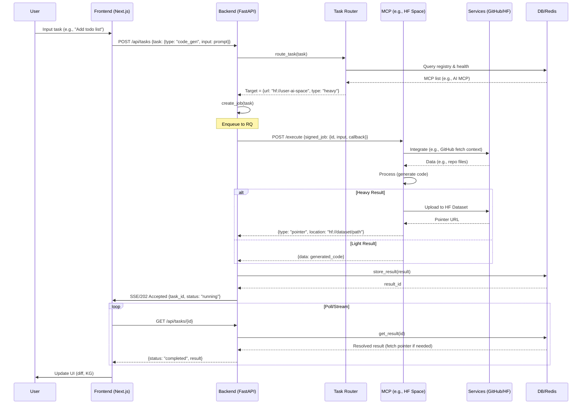

# End-to-End Data Flow

The Vibe Coding Tool's data flow follows a request-response pattern optimized for async processing and distributed execution. User inputs from the frontend trigger tasks in the backend orchestrator, which routes to MCPs based on capabilities. Results are handled efficiently with caching for small data and pointers for large outputs (e.g., KG exports). This ensures low latency for light tasks and scalability for heavy compute.

## Core Principles

- **Async Processing**: Tasks queue via Redis/RQ; results stream via SSE or poll.
- **Pointer-Based Results**: Heavy MCPs (e.g., Semgrep scans) store in HF Datasets, return lightweight pointers to avoid large payloads.
- **Consent and Fallbacks**: Preflight checks for user MCPs; fallbacks to oracle with UI consent.
- **Tracing**: All flows emit Prometheus metrics; spans for debugging.

From the technical specifications, the flow supports complete user journeys: onboarding → project creation → task execution → visualization.

## End-to-End Data Flow

1. **Input**: User interacts (e.g., "Generate todo component") in frontend chat/agent UI.
2. **Task Creation**: Frontend sends POST /api/tasks with task spec (type, input, capabilities).
3. **Routing**: Backend TaskRouter matches to MCP (e.g., code_gen → AI MCP in HF Space).
4. **Execution**: JobManager enqueues; worker dispatches to MCP URL with signed envelope (RS256).
5. **MCP Processing**: MCP executes (light: oracle; heavy: user Space), returns result or pointer.
6. **Result Handling**: ResultManager stores (Redis/DB or HF); notifies via callback/SSE.
7. **Output**: Frontend polls/receives stream, updates UI (editor diff, KG graph).

Error paths: Retries (3x), fallback, user notification.

## Sequence Diagram for User Task Flow

Adapted from Technical_Specifications.md and development plans:

This diagram shows a code generation flow: From user prompt to MCP execution, with pointer handling for large outputs. For KG building, S would be kglab MCP ingesting files.

## Result Resolution

For pointers:
- Backend resolves on GET /results/{id}: Fetches from HF if pointer.
- Frontend handles via React Query caching to avoid refetches.

## Monitoring Data Flow

- Metrics: Task latency, MCP success rate, queue depth (Prometheus).
- Logs: Structured events (e.g., "task_routed: mcp=semgrep, duration=2s").
- Traces: OpenTelemetry spans for end-to-end visibility.

For MCP-specific flows: See [MCP Servers](../mcps/development.md). Implementation: [Backend Job Management](backend.md#job-management).

Back to [Overview](overview.md).