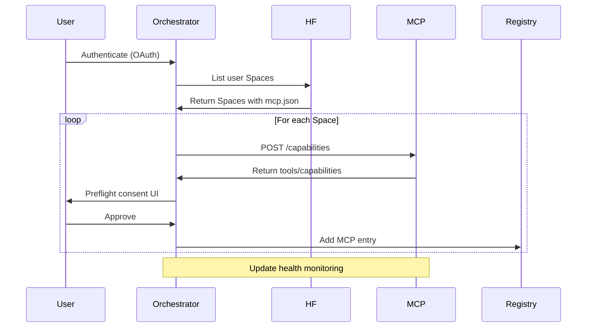

# MCP Registry and Routing

The MCP Registry is a core component of the MetaMCP orchestrator, managing discovery, health monitoring, and routing to Model Context Protocol (MCP) servers. It enables dynamic selection of MCPs based on task requirements, supporting the split-processing model where lightweight tasks run on the oracle and heavy tasks on user HF Spaces. The registry is loaded from `metamcp_registry.json` and cached in Redis for fast lookups.

## Registry Structure

The registry is a JSON configuration defining available MCPs, their capabilities, and routing flags. From the development plans and split-processing model:

```json
{
  "mcps": [
    {
      "id": "github-wrapper",
      "name": "GitHub File-Seek MCP",
      "url": "http://oracle-worker:8000",
      "capabilities": ["file_operations", "repo_management"],
      "can_run_on_user_space": false,
      "result_pointer_preferred": false,
      "fallback_to_oracle": true,
      "health_endpoint": "/health",
      "auth_type": "jwt"
    },
    {
      "id": "semgrep-mcp",
      "name": "Semgrep Code Analysis",
      "url": "https://user-semgrep.hf.space",
      "capabilities": ["code_analysis", "security_scan"],
      "can_run_on_user_space": true,
      "result_pointer_preferred": true,
      "fallback_to_oracle": false,
      "health_endpoint": "/health",
      "auth_type": "hf_token"
    },
    {
      "id": "kglab-gkg",
      "name": "kglab GKG Ingest",
      "url": "https://user-kglab.hf.space",
      "capabilities": ["kg_ingest", "sparql_query"],
      "can_run_on_user_space": true,
      "result_pointer_preferred": true,
      "fallback_to_oracle": true,
      "health_endpoint": "/health",
      "auth_type": "hf_token"
    }
  ]
}
```

Key Fields:
- **id/name**: Unique identifier and display name.
- **url**: Base URL (oracle or HF Space).
- **capabilities**: List of supported tools (e.g., "file_search", "code_gen").
- **can_run_on_user_space**: Boolean; true for deployable to HF Spaces.
- **result_pointer_preferred**: True for heavy results (store in HF Dataset, return pointer).
- **fallback_to_oracle**: Allow oracle fallback on failure (with consent).
- **health_endpoint**: Path for liveness probe.
- **auth_type**: "jwt", "hf_token", etc.

Load via `RegistryManager.load_registry()` in `core/registry.py`.

## Capability Matching

The `CapabilityMatcher` ranks MCPs for a task by matching required capabilities against the registry.

Features:
- **Query Capabilities**: For a task (e.g., {"required_capabilities": ["code_analysis"]}), filter MCPs.
- **Ranking**: Score by factors like load, location preference, cost (e.g., user Space > oracle for privacy).
- **Dynamic Discovery**: Probes user HF Spaces for custom MCPs via HF API.

Example from plan:
```python
class CapabilityMatcher:
    def match_task_to_capabilities(self, task: Task, capabilities: List[str]) -> List[MCPInfo]:
        """Filter MCPs supporting all required capabilities"""
        return [mcp for mcp in self.registry.mcps if all(cap in mcp.capabilities for cap in capabilities)]
    
    def rank_mcps_for_task(self, task: Task, mcps: List[MCPInfo]) -> List[MCPInfo]:
        """Rank by suitability (e.g., user_space first, low load)"""
        def score(mcp: MCPInfo) -> float:
            base = 1.0
            if mcp.can_run_on_user_space and task.user_space_available:
                base += 2.0  # Prefer user isolation
            if not mcp.result_pointer_preferred and task.is_heavy:
                base -= 1.0  # Penalize for large results
            return base / (mcp.current_load or 1)
        return sorted(mcps, key=score, reverse=True)
```

Used by TaskRouter for optimal selection.

## Health Monitoring

The `RegistryManager` periodically checks MCP health to update availability.

Features:
- **Probes**: HTTP GET to health_endpoint; expect 200 with {"status": "healthy"}.
- **Status Updates**: Marks MCPs as "available" or "unhealthy"; routes avoid unhealthy.
- **Dynamic Updates**: On user Space deployment, re-probe and add to registry.

Example:
```python
class RegistryManager:
    async def validate_mcp_health(self, mcp_id: str) -> HealthStatus:
        """Check MCP health"""
        mcp = self.get_mcp(mcp_id)
        try:
            resp = await httpx.get(f"{mcp.url}{mcp.health_endpoint}", timeout=5)
            if resp.status_code == 200:
                mcp.status = "available"
                return HealthStatus.OK
            else:
                mcp.status = "unhealthy"
                return HealthStatus.ERROR
        except Exception:
            mcp.status = "unhealthy"
            return HealthStatus.ERROR
    
    def update_mcp_status(self, mcp_id: str, status: MCPStatus) -> None:
        """Update after probe"""
        self.registry.mcps[mcp_id].status = status
        self.redis.set(f"mcp_status:{mcp_id}", status.value)
```

Cron job runs every 30s; unhealthy MCPs trigger fallbacks.

## Dynamic Discovery

Supports auto-discovery of user MCPs in HF Spaces.

Features:
- **User Space Scan**: On auth, query HF API for user's Spaces with mcp.json.
- **Capability Probe**: POST to /capabilities endpoint to fetch tools.
- **Consent Flow**: Preflight UI for adding new MCPs (from preflight_consent artifacts).

Sequence for Discovery:



This enables seamless integration of custom MCPs like Libraries.io or Your-PaL-MoE.

For implementation: See [MCP Development](../developer/mcp-development.md). Cross-ref: [Task Routing](../backend.md#task-routing).

Back to [Overview](overview.md).