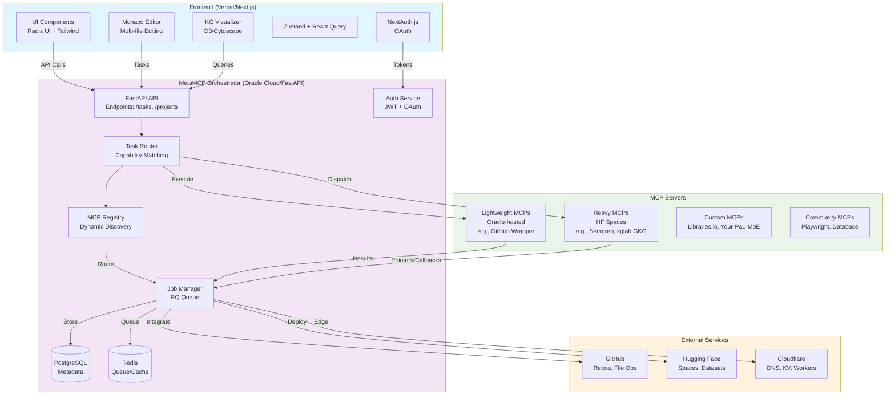

# Architecture Overview

The Vibe Coding Tool is built on a modular, split-processing architecture that leverages the MetaMCP protocol for intelligent task orchestration. This design separates lightweight coordination (oracle-hosted) from heavy compute (user HF Spaces), ensuring scalability, privacy, and cost-efficiency. Core principles include:

- **Dynamic Routing**: Tasks are routed based on MCP capabilities, resource needs, and user consent via the registry.
- **Decoupled Components**: Frontend for UI/editing, backend for orchestration, external MCPs for specialized processing.
- **Data Flow**: User inputs → Task creation → MCP execution → Result caching/pointers → UI updates.
- **Security**: JWT auth, job signing (RS256), preflight consent for fallbacks.

This architecture supports 95% project coverage, from code generation to KG visualization, serving end-users to DevOps.

## Component Breakdown

- **Frontend (Next.js)**: Handles UI, Monaco Editor, KG viz (D3/Cytoscape), state (Zustand). Deployed to Vercel.
- **Backend Orchestrator (FastAPI)**: Task router, job manager, MCP registry, auth (JWT/OAuth). Uses PostgreSQL for metadata, Redis for queue/cache.
- **MCP Ecosystem**: Built-in (Semgrep, Tree-sitter), custom (Libraries.io, GitHub wrapper), community (Playwright). Heavy MCPs in HF Spaces.
- **Integrations**: GitHub for repos, HF for Spaces/datasets, Cloudflare for edge services.
- **Monitoring**: Prometheus/Grafana for metrics, structlog for logging.

See [Backend Architecture](backend.md), [Frontend Architecture](frontend.md), [MCP Registry](mcp-registry.md), and [Data Flow](data-flow.md) for details.

## High-Level Architecture Diagram

This diagram illustrates the end-to-end flow: User interactions in the frontend trigger API calls to the orchestrator, which routes tasks to appropriate MCPs or external services. Results are cached and visualized.

## Data Flow Summary

User tasks (e.g., code gen) are parsed, routed via capabilities (e.g., file ops → GitHub MCP), executed (light on oracle, heavy on user Space), and results returned (direct or via pointers). Fallbacks ensure reliability.

For technical depth: [Data Flow](data-flow.md) with sequence diagram.

Back to [Architecture Index](../index.md) or [Getting Started](/docs/getting-started/index.md).